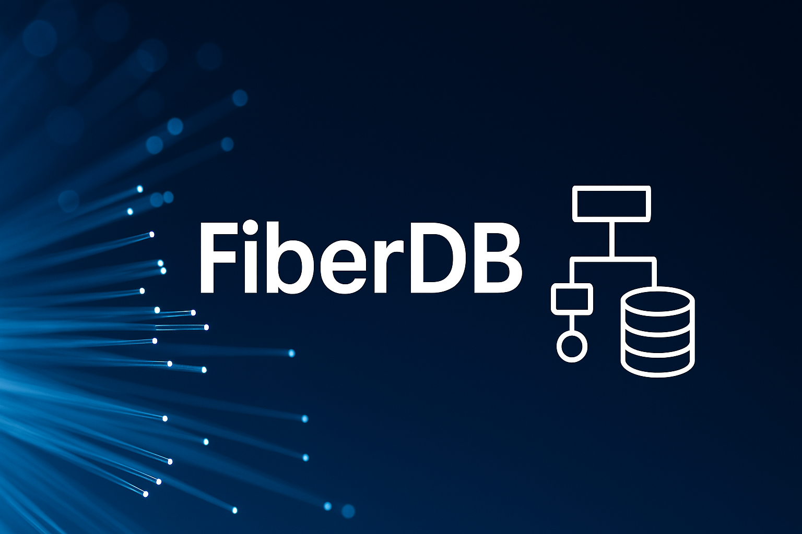

# FiberDB



**FiberDB** is a lightweight, anchor-based federated database engine built with [Bun](https://bun.sh). It enables flexible ingestion of structured and semi-structured data from multiple systems, relationship-based modeling, secure field-level encryption, and efficient querying via a powerful API layer.

---

## 🚀 Features

- Anchor-based document storage: e.g., `customer`, `asset`, etc.
- Attached documents: logs, service-requests, chat history, maintenance, etc.
- Field-level AES-256 encryption with selective decryption per query
- Multi-entity querying with nested filtering and relationships
- Advanced filter operators (`eq`, `ne`, `gt`, `lt`, `contains`, `in`)
- TTL/archival system to exclude stale data
- Dynamic API layer for querying data from FiberDB
- Detailed performance metrics for queries, inserts, and relationships

---

## 📁 Project Structure

```
.
├── src/                      # Source code directory
│   ├── core/                 # Core database functionality
│   │   ├── storage/          # Storage and data persistence
│   │   ├── query/            # Query engine and processors
│   │   ├── crypto/           # Encryption and security
│   │   └── indexing/         # Indexing subsystem
│   ├── api/                  # API and server endpoints
│   ├── utils/                # Utility functions and helpers
│   ├── types/                # TypeScript type definitions
│   ├── seeders/              # Data generators for testing
│   │   └── sap-utilities/    # SAP Utilities data seeders
│   └── config.ts             # Configuration settings
├── benchmarks/               # Performance benchmarks
│   ├── cache/                # Cache performance tests
│   ├── indexing/             # Indexing performance tests
│   └── parallel/             # Parallel processing tests
├── data/                     # Anchor and attached entity storage
│   ├── anchors/              # Anchor document storage
│   └── attached/             # Attached document storage
├── package.json              # Project configuration
├── Dockerfile                # Docker container configuration
├── docker-compose.yml        # Docker Compose configuration
└── README.md                 # Project documentation
```

For more details about the project structure, see [PROJECT_STRUCTURE.md](./PROJECT_STRUCTURE.md).

---

## 🛠️ Getting Started

### Option 1: Running with Bun

#### 1. Install Bun

```bash
curl -fsSL https://bun.sh/install | bash
```

#### 2. Run FiberDB server (includes the optional query API)

```bash
bun run start
```

Server will start at: `http://localhost:4000`

### Option 2: Running with Docker

#### 1. Build and run with Docker Compose

```bash
# Build and start the FiberDB container
docker-compose up -d

# View logs
docker-compose logs -f
```

Server will start at: `http://localhost:3000`

#### 2. Build and run manually with Docker

```bash
# Build the Docker image
docker build -t fiberdb .

# Run the container
docker run -p 3000:3000 -v ./data:/app/data fiberdb
```

### 3. Seed Test Data (Optional)

```bash
# Generate default sample data
bun run seed

# Generate only SAP Utilities data (50 business partners)
bun run seed:sap

# Generate a larger SAP Utilities dataset (200 business partners)
bun run seed:sap-large

# Custom seeding options
bun run src/seeders/run-seeder.ts --sap-only --sap-bp-count 100 --clear
```

### 4. Run Performance Benchmarks (Optional)

```bash
# Run all benchmarks
bun run benchmark

# Run specific benchmarks
bun run benchmark:cache
bun run benchmark:parallel
bun run benchmark:indexing
```

---

## 📦 Database Concepts & Capabilities

### Core Concepts

FiberDB uses two primary data structures:

1. **Anchors**: Core entities that serve as primary data points (e.g., customers, assets, business partners)
2. **Attachments**: Related data connected to anchors (e.g., service requests, meter readings, addresses)

This design enables a flexible, document-based architecture while maintaining relational capabilities.

### Anchor-Based Storage Model

The anchor-based model allows:

- **Vertical Data Partitioning**: Separate core entities from related data
- **Flexible Schema**: Add new attached documents without changing the anchor structure
- **Entity Relationships**: Connect and query across entities
- **Selective Loading**: Only load required data attachments during queries

### Data Operations

#### Creating Anchors

```ts
// Create a new business partner
saveAnchor("business-partner", "BP12345678", {
  id: "BP12345678",
  firstName: "John",
  lastName: "Doe",
  customerClassification: "A",
  birthDate: "1985-05-15"
}, { 
  secureFields: ["firstName", "lastName", "birthDate"], 
  key: "encryption-key" 
});
```

#### Attaching Related Data

```ts
// Attach address information to a business partner
attachToAnchor("BP12345678", "addresses", [
  {
    street: "123 Main St",
    city: "Springfield",
    postalCode: "12345",
    addressType: "BILL"
  }
]);

// Attach contract information
attachToAnchor("BP12345678", "contracts", [
  {
    contractId: "CT12345",
    utilityType: "ELEC",
    startDate: "2023-01-01",
    status: "ACTIVE"
  }
]);
```

### Query System

FiberDB provides a powerful query system with multiple capabilities:

#### Basic ID Queries

```ts
// Query a specific business partner by ID
const result = await query({
  primary: "business-partner",
  id: "BP12345678"
});
```

#### Field Selection

```ts
// Query with specific field selection
const result = await query({
  primary: "business-partner",
  id: "BP12345678",
  include: ["firstName", "lastName", "addresses", "contracts"]
});
```

#### Filtering

```ts
// Filter business partners by classification
const result = await query({
  primary: "business-partner",
  filter: { customerClassification: "A" },
  include: ["firstName", "lastName"]
});
```

#### Advanced Filtering with Operators

```ts
// Find business partners with active contracts
const result = await query({
  primary: "business-partner",
  include: ["firstName", "lastName", "contracts"],
  where: {
    "contracts.status": { eq: "ACTIVE" }
  }
});

// Find business partners with high-priority service requests
const result = await query({
  primary: "business-partner",
  include: ["firstName", "lastName", "service-requests"],
  where: {
    "service-requests.priority": { gt: 3 }
  }
});

// Text search capabilities
const result = await query({
  primary: "business-partner",
  include: ["firstName", "lastName", "addresses"],
  where: {
    "addresses.city": { contains: "Springfield" }
  }
});

// Array membership check
const result = await query({
  primary: "business-partner",
  filter: {
    region: { in: ["WEST", "SOUTH"] }
  }
});

// Inequality check
const result = await query({
  primary: "business-partner",
  filter: {
    customerClassification: { ne: "D" }
  }
});
```

#### Combined Filters

```ts
// Complex query combining anchor and attachment filters
const result = await query({
  primary: "business-partner",
  filter: { 
    customerClassification: "A",
    region: "WEST" 
  },
  include: ["firstName", "lastName", "contracts", "meters"],
  where: {
    "contracts.status": { eq: "ACTIVE" },
    "contracts.utilityType": { eq: "ELEC" },
    "meters.isSmartMeter": { eq: true }
  }
});
```

### Security & Encryption

FiberDB provides field-level encryption:

```ts
// Encrypt sensitive fields during storage
saveAnchor("business-partner", "BP12345678", {
  id: "BP12345678",
  firstName: "John",
  lastName: "Doe",
  socialSecurityNumber: "123-45-6789"
}, { 
  secureFields: ["firstName", "lastName", "socialSecurityNumber"], 
  key: "encryption-key" 
});

// Query with decryption key to access secure fields
const result = await query({
  primary: "business-partner",
  id: "BP12345678",
  include: ["firstName", "lastName", "socialSecurityNumber"],
  decryptionKey: "encryption-key"
});
```

Without the decryption key, encrypted fields remain encrypted in query results.

### Performance Optimization

#### Caching System

FiberDB uses a multi-level caching system:

```ts
// Use caching for better performance (enabled by default)
const result = await query({
  primary: "business-partner",
  id: "BP12345678"
});

// Force fresh data by skipping cache
const freshResult = await query({
  primary: "business-partner",
  id: "BP12345678",
  skipCache: true
});
```

#### Parallel Processing

```ts
// Enable parallel processing for large datasets
const result = await query({
  primary: "business-partner",
  include: ["firstName", "lastName", "contracts"],
  useParallel: true
});
```

#### Indexing

```ts
// Use index-based queries (enabled by default)
const result = await query({
  primary: "business-partner",
  filter: { region: "WEST" },
  useIndexes: true
});
```

### Performance Measurement

```ts
// Enable performance metrics in your query
const result = await query({
  primary: "business-partner",
  filter: { customerClassification: "A" },
  includePerformanceMetrics: true
});

// Access metrics in the result
console.log(result[0].__metrics);
```

### Query Examples

FiberDB includes comprehensive query examples demonstrating all available query types and performance optimizations:

```bash
# First, seed the database with test data
bun run seed:sap

# Then run the query examples
bun run examples
```

> **Important**: The examples require data to be seeded first, otherwise all queries will return empty results.

The examples are located in `src/examples/query-examples.ts` and cover:

1. **Basic Queries**
   - Single entity by ID
   - All entities of a type
   - Field selection
   - Wildcard field inclusion
   - Specific attachment selection

2. **Filtering**
   - Simple equality filters
   - Multiple conditions (AND logic)
   - Filtering on attached documents
   - Combined primary and attachment filters

3. **Advanced Filtering Operators**
   - Equality (`eq`)
   - Not Equal (`ne`)
   - Greater Than (`gt`)
   - Less Than (`lt`)
   - Contains (text search)
   - In (value in array)
   - Combined operators

4. **Security & Encryption**
   - Queries with encrypted fields
   - Queries with decryption key

5. **Performance Optimizations**
   - Caching system usage
   - Parallel processing
   - Index-based queries
   - Performance metrics

6. **API Integration**
   - HTTP API request examples
   - Header-based performance controls

You can use these examples as templates for your own queries, adapting them to your specific use cases.

### Testing

FiberDB includes a comprehensive testing suite to ensure reliability and correctness:

```bash
# Run all tests
bun run test
```

#### Test Architecture

Our testing approach consists of three main strategies:

1. **Unit Tests**: Testing individual components in isolation
   - Core query methods
   - Cache utilities
   - API endpoints
   
2. **Integration Tests**: Testing interactions between components
   - API router with endpoint handlers
   - Query systems with storage layer
   
3. **Mock-based Testing**: Using mock dependencies for reliable tests
   - File system mocks to avoid actual I/O operations
   - Service mocks to simulate external dependencies
   - Response mocks to verify correct output formats

#### Test Organization

```
src/tests/
├── api/                 # API-related tests
│   ├── endpoints.test.ts # Tests for API endpoint handlers
│   └── router.test.ts    # Tests for API routing
├── core/                # Core functionality tests
│   └── query-methods.test.ts # Tests for query engine
└── utils/               # Utility tests
    └── cache.test.ts    # Tests for caching system
```

#### Writing Tests

When contributing new features, please follow these testing guidelines:

1. Create tests in the appropriate directory based on the component being tested
2. Use mocks to avoid external dependencies and filesystem operations
3. Test both success and error cases
4. Keep tests isolated and independent from one another
5. Use descriptive test names that explain the expected behavior

### HTTP API Usage

```bash
# Query via API
curl -X POST http://localhost:4000/query \
  -H "Content-Type: application/json" \
  -H "X-Include-Performance-Metrics: true" \
  -d '{
    "primary": "business-partner",
    "filter": { "customerClassification": "A" },
    "include": ["firstName", "lastName", "contracts"],
    "where": {
      "contracts.status": { "eq": "ACTIVE" }
    },
    "decryptionKey": "encryption-key"
  }'
```

API Control Headers:
- `X-Skip-Cache: true` - Force a fresh query without using cache
- `X-Use-Parallel: true` - Enable parallel processing for the query
- `X-Include-Performance-Metrics: true` - Include detailed timing information

---

## 🌱 Data Seeding

FiberDB includes a seeding system to generate realistic test data.

### SAP Utilities Data

Generate SAP Utilities business partner data with realistic relationships:

```bash
# Generate 50 business partners with related data
bun run seed:sap

# Generate 200 business partners with related data
bun run seed:sap-large
```

### Available Seeders

- **Business Partners**: Generates realistic business partners with SAP-style fields
- **Addresses**: Creates multiple address types (billing, installation)
- **Contracts**: Generates utility contracts with appropriate relationships
- **Meters**: Creates meter installations linked to active contracts
- **Bank Accounts**: Generates bank account information with secure fields
- **Contact Information**: Creates email, phone, and mobile contact details

### Custom Seeding

```bash
# Custom seeding with specific options
bun run src/seeders/run-seeder.ts --sap-only --sap-bp-count 100 --clear
```

Options:
- `--clear`: Clear existing data before seeding
- `--sap-only`: Only generate SAP Utilities data
- `--sap-bp-count <number>`: Number of business partners to generate

---

## 📊 Performance Optimization

FiberDB includes advanced performance optimizations:

### Query Performance Control

All performance optimizations can be controlled through query parameters:

```ts
// Enable all performance optimizations
const result = await query({
  primary: "business-partner",
  filter: { customerClassification: "A" },
  
  // Performance control parameters
  skipCache: false,        // Use cache when available
  useParallel: true,       // Enable parallel processing
  useIndexes: true,        // Use indexes for filtering
  includePerformanceMetrics: true  // Include timing metrics
});
```

When using the HTTP API, these controls can be set through request headers:

```bash
curl -X POST http://localhost:4000/query \
  -H "Content-Type: application/json" \
  -H "X-Skip-Cache: false" \
  -H "X-Use-Parallel: true" \
  -H "X-Include-Performance-Metrics: true" \
  -d '{ "primary": "business-partner" }'
```

For comprehensive examples of all performance optimizations, see the [Query Examples](#query-examples) section.

### Caching System

- **Document Caching**: LRU cache for frequently accessed JSON documents
- **Query Result Caching**: Cache query results to avoid repeated processing
- **File Existence Caching**: Avoid repeated filesystem checks
- **TTL-based Caching**: Automatic expiration of cached data
- **Cache Invalidation**: Smart invalidation on writes

### Parallel Processing

- **Asynchronous File I/O**: Non-blocking file operations with Bun's optimized I/O
- **Concurrent Processing**: Process multiple files simultaneously
- **Promise.all**: Parallel execution of file operations
- **Performance Scaling**: Up to 5x faster for large datasets

Performance improvements with parallel processing:
- Small datasets (1-5 files): Traditional synchronous processing is faster
- Medium datasets (50-200 files): 24-60% faster with parallel processing
- Large datasets (600+ files): 74-81% faster with parallel processing

### Indexing

- **Hash Indexes**: Fast equality lookups for specific fields
- **Range Indexes**: Efficient gt/lt comparisons
- **Text Indexes**: Optimized text search capabilities
- **Automatic Index Selection**: Uses the most appropriate index for each query
- **Index Statistics**: Tracks index usage and performance

### API Control Headers

When using the HTTP API, you can control performance features:

- `X-Skip-Cache: true` - Force a fresh query without using cache
- `X-Use-Parallel: true` - Enable parallel processing for the query
- `X-Include-Performance-Metrics: true` - Include detailed timing information

### Monitoring

Access cache statistics via the `/cache` endpoint:
- `GET /cache` - View cache statistics
- `DELETE /cache` - Clear all caches

---

## 👥 Contributing

We welcome contributions to FiberDB! Whether you're fixing bugs, improving documentation, or proposing new features, your help is appreciated.

### Getting Started

1. **Fork the Repository**
   - Create your own fork of the project on GitHub

2. **Clone Your Fork**
   ```bash
   git clone https://github.com/YOUR_USERNAME/fiberdb.git
   cd fiberdb
   ```

3. **Install Dependencies**
   ```bash
   bun install
   ```

4. **Create a Feature Branch**
   ```bash
   git checkout -b feature/your-feature-name
   ```

### Development Guidelines

1. **Code Style**
   - Follow the existing code style and structure
   - Maintain consistent indentation (2-space indentation)
   - Use meaningful variable and function names
   - Include type annotations for all functions and variables

2. **Module Organization**
   - Place new features in the appropriate module
   - For new capabilities, follow the modular architecture
   - Create new modules in the correct subdirectory

3. **Testing**
   - Write tests for all new features
   - Ensure existing tests pass before submitting PR
   - Include performance benchmarks for performance-critical code

4. **Documentation**
   - Document all public APIs with JSDoc comments
   - Update README.md for any user-facing changes
   - Create examples for new features

### Contribution Process

1. **Create Focused Changes**
   - Keep pull requests focused on a single feature or fix
   - Break large changes into smaller, logical commits

2. **Make Consistent Commits**
   - Use clear, descriptive commit messages
   - Format: `[component] Short description (max 50 chars)`
   - Add more details in the commit body if needed

3. **Submit a Pull Request**
   - Push your branch to your fork
   - Create a PR against the main repository
   - Describe the changes in detail in the PR description
   - Reference any related issues using #issue_number

4. **Code Review**
   - Address review feedback promptly
   - Keep discussions focused on the code, not the person

### Areas for Contribution

We're especially interested in contributions in these areas:

- **Performance Optimizations**: Improvements to caching, indexing, and query processing
- **New Seeders**: Additional industry-specific data seeders
- **Query Enhancements**: New filter operators and aggregation features
- **Documentation**: Examples, tutorials, and improved API documentation
- **Testing**: Additional test coverage and benchmarks
- **Security**: Enhancements to the encryption and permission systems

### Creating New Seeders

If you're creating a new seeder:

1. Follow the structure in `src/seeders/sap-utilities/` as a template
2. Place domain-specific seeders in their own subdirectory
3. Implement a clean API with clear options
4. Document the seeder in the README
5. Add npm scripts to make the seeder easily accessible

### Contact

For questions or discussions about contributions, please open an issue on GitHub or reach out to the maintainers.

---

## 🧼 Cleanup Local Database

### Option 1: Local Cleanup
```bash
rm -rf data/
```

Or programmatically:
```ts
import fs from "fs";
fs.rmSync("data", { recursive: true, force: true });
```

### Option 2: Docker Cleanup
```bash
# Remove Docker volumes
docker-compose down -v

# Or if running manually
docker volume rm <volume-name>
```

---

## 🧱 Roadmap

- [x] Multi-level caching system
- [x] Improved project organization
- [x] Parallel query processing
- [x] Indexing system
- [x] Data seeders for testing
- [ ] Swagger UI for FiberDB query interface
- [ ] Ingest API for real-time data feeds
- [ ] Role-based field access
- [ ] Time-series optimizations
- [ ] Additional domain-specific seeders

---

## 📄 License
MiCustomer Open Source Foundation (FiberDB) is licensed under the [Apache License, Version 2.0](https://www.apache.org/licenses/LICENSE-2.0).